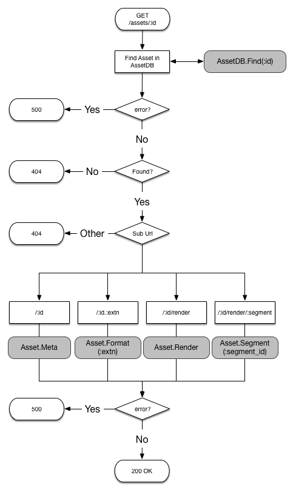

# Blasted! Media Server

The BMS is a simple media server designed to serve assets of various types.
Examples of assets are:
* Images
* Video files
* Journal entries
* Blog posts
* Movies
* TV Shows
* Books

Assets have meta data, and that metadata is specified by the asset type.  For
instance, a Movie asset may have metadata indicating the studio that produced
the movie, the list of lead actors as well as a plot synopsis.

Assets belong to collections and collections can have one ore more
sub-collections.  The system has a root collection that top-level collections
belong to.  Collections are themselves specialized assets.  Therefore, a
collection can have metadata.

Folder Layout Example:
```
├── Movies
│   ├── Avatar
│   ├── Spies Like Us
│   ├── Star Trek: The Motion Picture (1979)
│   ├── Star Trek II The Wrath of Khan (1982)
│   ├── Star Trek III The Search for Spock (1984)
│   ├── Star Trek IV The Voyage Home (1986)
│   ├── Star Trek V: The Final Frontier (1989)
│   ├── Star Trek VI The Undiscovered Country (1991)
│   ├── Star Trek: Generations (1994)
│   ├── Star Trek First Contact (1996)
│   ├── Star Trek: Insurrection (1998)
│   ├── Star Trek Nemesis (2002)
│   ├── Star Trek (2009)
│   └── Star Trek Into Darkness (2013)
└── TV Shows
    ├── House
    │   ├── Season 1
    │   ├── Season 2
    │   ├── Season 3
    │   ├── Season 4
    │   ├── Season 5
    │   ├── Season 6
    │   ├── Season 7
    │   └── Season 8
    ├── MASH
    └── Police Squad
        └── Season 1
```

Since assets can belong to more than one collection, it is possible to display
the asset hierarchy in more than one way.  The above assets could also belong to
collections such that the following layout is displayed:

```
├── Movies
│   ├── Avatar
│   ├── Spies Like Us
│   ├── Star Trek: The Motion Picture (1979)
│   ├── Star Trek II The Wrath of Khan (1982)
│   ├── Star Trek III The Search for Spock (1984)
│   ├── Star Trek IV The Voyage Home (1986)
│   ├── Star Trek V: The Final Frontier (1989)
│   ├── Star Trek VI The Undiscovered Country (1991)
│   ├── Star Trek: Generations (1994)
│   ├── Star Trek First Contact (1996)
│   ├── Star Trek: Insurrection (1998)
│   ├── Star Trek Nemesis (2002)
│   ├── Star Trek (2009)
│   ├── Star Trek Into Darkness (2013)
│   └── Star Trek
│       ├── Star Trek: The Motion Picture (1979)
│       ├── Star Trek II The Wrath of Khan (1982)
│       ├── Star Trek III The Search for Spock (1984)
│       ├── Star Trek IV The Voyage Home (1986)
│       ├── Star Trek V: The Final Frontier (1989)
│       ├── Star Trek VI The Undiscovered Country (1991)
│       ├── Star Trek: Generations (1994)
│       ├── Star Trek First Contact (1996)
│       ├── Star Trek: Insurrection (1998)
│       ├── Star Trek Nemesis (2002)
│       ├── Star Trek (2009)
│       └── Star Trek Into Darkness (2013)
```

In this case, the Movies collection contains a Star Trek collection.  The Star
Trek movies belong to both collections.  Therefore, when browsing the
collections, one would see the Star Trek movies in two places.

Users have access to the assets based on filters.  A user can only access the
assets that are exposed to him via filters applied to his profile.  A user with
no filters would have access to all assets/collections.  Filters can be applied
directly to a user or to a group and users can belong to zero or more groups.
Filters currently only match on collection membership.

# Assets

In its most basic form, an Asset is simply anything that can be served up using
HTTP.  All assets have a name, a globally unique identifier, a folder, an
optional list of collections, an optional list of tags and its metadata.

Path                        |  Verb  | Description
----------------------------|--------|--------------------------------------------------------
/assets                     | POST   | Create a new asset
/assets/:id(.:extension)    | GET    | Retrieve a specific asset
/assets/:id                 | PUT    | Update an asset's metadata
/assets/:id                 | DELETE | Delete an asset
/assets/:id/render          | GET    | Retrieve the actual asset
/assets/:id/render/:segment | GET    | Retrieve a specific segment for an asset (if supported)

Inbound requests, for specific assets, follow the following pre-defined flow:



If an error occurs while retrieving the asset, then the handler will return a
500 response code.  If the asset is not found, then the handler returns 404.
Once the asset is found, the appropriate sub-url is routed.  Any sub-url that is
not supported will trigger a 404.  Supported sub-urls should return a 200
reponse code with the appropriate content.

Two types are involved in processing requests for assets: the AssetDB type and
the Asset type.  AssetDB is the interface to searching for and retrieving
Assets.  Likewise, Assets are the interface to specific assets.

```Go
type AssetDB interface {
  Find(id uint64) (Asset *)
  Search(searchString string) ([] Asset *)
}
```

```Go
type Asset interface {
  Meta(resp http.ResponseWriter *)
  Format(extn string, resp http.ResponseWriter *)
  Render(http.ResponseWriter *)
  Segment(segmentId uint32, http.ResponseWriter *)
}
```

# Collections

A collection is a specialized asset that can contain other assets or
collections.  An asset always has an ID and a name and can include optional
metadata.  There can be different types of collections, and the collection types
can specify the metadata that's included.

Path                             |  Verb  | Description
---------------------------------|--------|--------------------------------------------------------
/collections                     | POST   | Create a new collection
/collections/:id                 | GET    | Retrieve a collection
/collections/:id                 | PUT    | Update a collections's metadata
/collections/:id                 | DELETE | Delete a collection
/collections/search              | GET    | Search the root collection
/collections/:id/search          | GET    | Search a specific collection

